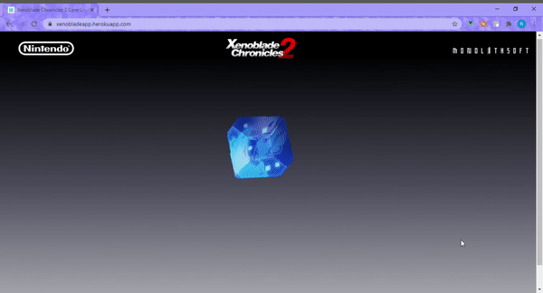

# xenobladeapp



Demo at: 
http://xenobladeapp.herokuapp.com
The api may need to load after the first click of the core crystal if the site has been inactive for a little while. The site will work quickly and efficiently after that.

This is a mock-up promotional website for one of my favorite games Xenoblade Chronicles 2. Click on the "Core Crystal" and a random character from the game will pop up. There is a description of the character and a link to buy the game. In the game, when a character touches a "Core Crystal" a new character will join your team depending on which character touched it. This application is based off of other "Which character am I?" applications prevelant across the internet where a user can relate to a description of a character.

## Project setup
```
npm install
```

### Compiles and hot-reloads for development
```
npm run serve
```

### Compiles and minifies for production
```
npm run build
```

### Run your tests
```
npm run test
```

### Lints and fixes files
```
npm run lint
```

### Customize configuration
See [Configuration Reference](https://cli.vuejs.org/config/).
